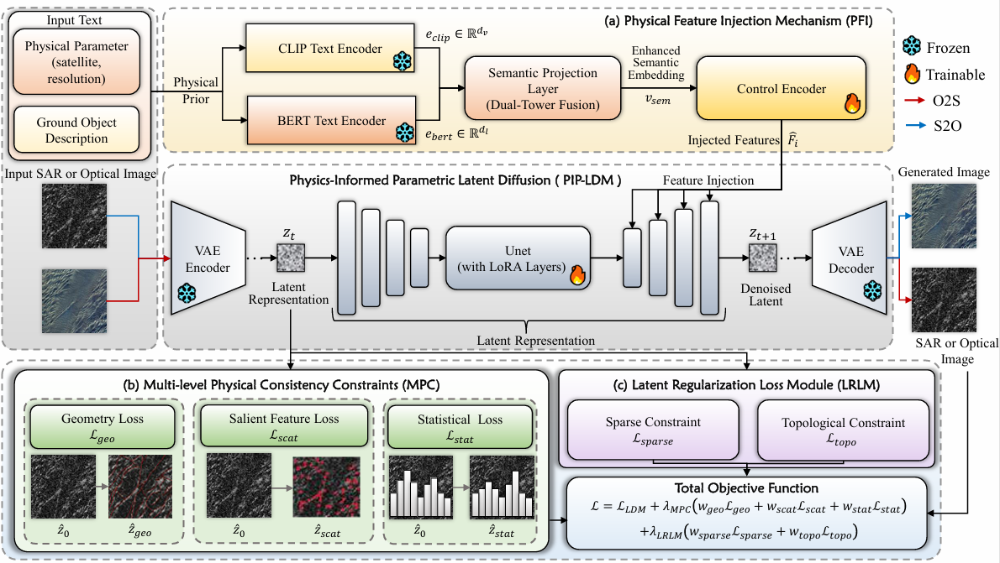

# Physics-Aware Parametric Latent Diffusion for Optical-SAR Cross-Modal Image Generation

[](https://opensource.org/licenses/MIT)
[](https://pytorch.org/)

Optical-SAR cross-modal generation, particularly optical-to-SAR (O2S) translation, is a fundamental problem in remote sensing that requires bridging two intrinsically different imaging modalities. However, most existing approaches reduce this problem to statistical style transfer and ignore the imaging physics that govern SAR backscatter. As a result, scattering centers are often mislocalized, speckle statistics deviate from real SAR distributions, and latent-space compression erases the sparse structural patterns intrinsic to SAR data. To address these issues, we propose a physics-aware parametric latent diffusion model (PIP-LDM) for high-fidelity cross-modal generation. We design physical feature injection (PFI) to incorporate imaging parameters and scene semantics through a dual-stream encoder. We further construct a multi-level physical consistency constraint (MPC) that regularizes the generation process at three levels, covering macro-scale geometric structure, dominant scattering centers, and micro-scale speckle statistics. In addition, we propose a latent regularization loss module (LRLM) that alleviates SAR feature degradation in latent space by preserving sparsity and connectivity of sparse scattering structures. Across four benchmark datasets spanning spatial resolutions from 1\,m to 10\,m, PIP-LDM improves cross-modal generation in both directions over the previous state of the art. It reduces FID by 4.63\% on average for O2S and 7.44\% for S2O, with dataset-specific reductions reaching up to 42.14\% on WHU-OPT-SAR in the S2O setting. It also improves physical consistency, producing more accurate scattering-center localization, more faithful speckle statistics, and more realistic geometric edges.


## 🌟 Key Innovations

To address the common issues of mislocalized scattering centers, distorted speckle statistics, and structural degradation in latent spaces, PIP-LDM introduces three novel modules:

* **Physical Feature Injection (PFI):** A dual-stream architecture that systematically incorporates imaging-condition descriptors (e.g., satellite platform, spatial resolution) and scene-level object semantics into the generative process.
* **Multi-level Physical Consistency Constraint (MPC):** A regularization module that enforces physical realism across three scales:
    * *Macro-scale:* Geometric structure alignment using gradient-domain constraints.
    * *Feature-scale:* Dominant scattering center preservation via a statistically thresholded mask.
    * *Micro-scale:* Speckle statistics consistency by matching latent feature moments (mean and variance).
* **Latent Regularization Loss Module (LRLM):** Mitigates the low-pass filtering effect of standard VAEs by applying an $L_1$-norm sparsity penalty and Gram matrix-based connectivity regularization to preserve SAR-specific sparse structures in the latent space.

## 📊 Supported Datasets

PIP-LDM has been extensively evaluated and generalizes well across diverse scenes and spatial resolutions (from 1m to 10m). Supported datasets include:

* **SEN12:** 10m resolution, Sentinel-1 / Sentinel-2 pairs.
* **WHU-OPT-SAR:** 5m resolution, Gaofen-3 / Gaofen-1 pairs.
* **QXS-SAROPT:** 1m resolution, Gaofen-3 / Google Earth pairs.
* **OSDataset:** 1m resolution, Sentinel-1 / Google Earth pairs.

## 🛠️ Installation

**1. Clone the repository:**
```bash
git clone https://github.com/AIR-TCAT/pip_ldm_optsar.git
cd PIP-LDM
```

**2. Create a virtual environment and install dependencies:**
```bash
conda create -n pip-ldm python=3.9
conda activate pip-ldm
pip install -r requirements.txt
```

## 📂 Data Preparation

Please organize your datasets in the following structure before training:

```text
dataset_name/
├── train/
│   ├── opt_0001.png
│   ├── sar_0001.png
├── val/
├── test/
└── train_captions.json  # Containing scene semantics and imaging conditions
```

## 📖 Citation

If you find this code or our paper useful for your research, please cite our work:

```bibtex

```

## 📄 License
This project is released under the [MIT License](LICENSE).